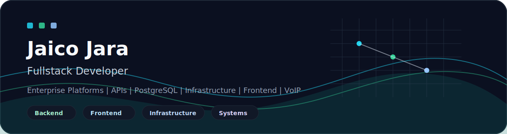
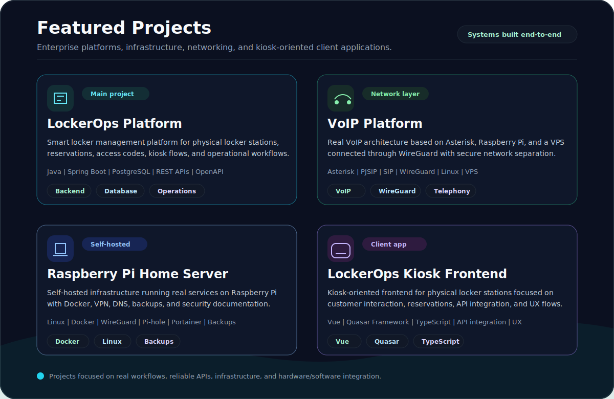
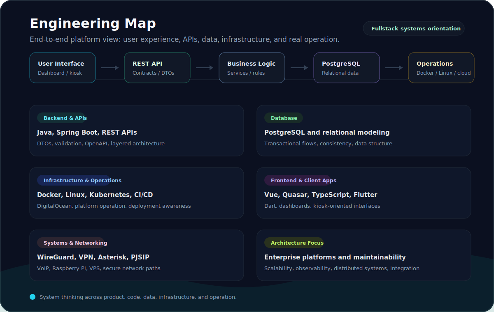

  

<h1 align="center">Jaico Jara</h1>

  <strong>Fullstack Developer | Enterprise Platforms | Distributed Systems | Infrastructure | Hardware/Software Integration</strong>

  I am a Fullstack Developer focused on building and understanding systems end-to-end, from user interfaces and APIs to databases, infrastructure, and real platform operation.

  
  
  

---

## About Me

I build and study systems end-to-end: frontend -> backend -> database -> infrastructure -> operations.

My work has a strong backend, database, infrastructure, and systems orientation: APIs, PostgreSQL, software architecture, transactional systems, infrastructure-aware development, and real platform operation.

Frontend is an important complementary skill in my work, especially for operational dashboards, kiosk-oriented interfaces, and client applications that need to connect cleanly with backend services.

## What I Build

- Enterprise backend platforms
- REST APIs and transactional services
- Smart locker platforms
- Kiosk-oriented applications
- Operational dashboards
- Self-hosted infrastructure
- VoIP and networking systems
- Hardware/software integrated platforms

## Tech Stack

### Backend & APIs

### Databases

### Infrastructure & Operations

### Systems & Networking

### Frontend & Client Apps

### Hardware/Software Integration

## Featured Projects

  

  <strong>Project links:</strong>
  LockerOps Platform: Coming soon |
  VoIP Platform: Coming soon |
  <a href="https://github.com/jaikostatham/raspberry-pi-home-server">Raspberry Pi Home Server</a> |
  LockerOps Kiosk Frontend: Coming soon

## Engineering Focus

- Backend architecture
- API design
- Database modeling
- Platform maintainability
- Observability
- Infrastructure-aware development
- Distributed systems
- Hardware/software integration
- Real operation and debugging

## Currently Learning / Deepening

- Java and Spring Boot
- Software architecture
- API design
- PostgreSQL
- Cloud and containers
- Observability
- Distributed systems
- Hardware/software integration

## Engineering Map

  

## Contact / Links

- LinkedIn: http//:www.linkedin.com/in/jaico-jara
- Email: http//:jaikostatham10@gmail.com
